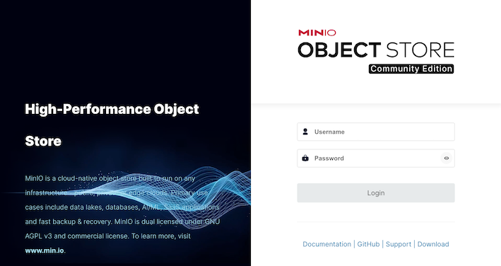
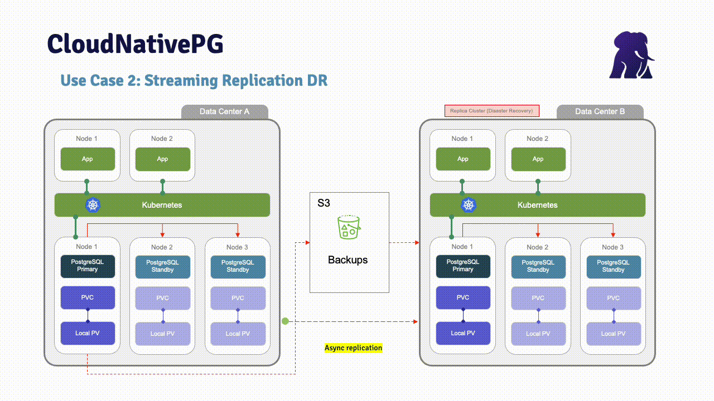

[](https://shields.io/)
[](https://GitHub.com/Naereen/StrapDown.js/graphs/commit-activity)

# Prerequisites
- Have a working Red Hat OpenShift platform up & running.
- Minio client ([mc](https://docs.min.io/community/minio-object-store/reference/minio-mc.html))
- CloudNativePG plugin ([kubectl-cnpg](https://www.enterprisedb.com/docs/postgres_for_kubernetes/latest/kubectl-plugin/))

# Description
These scripts are based in CloudNativePG project:
- [CloudNativePG](https://cloudnative-pg.io)
- [CloudNativePG github](https://github.com/cloudnative-pg/cloudnative-pg)

The goal is to demonstrate CloudNativePG with disaster recovery in a Red Hat OpenShift environment. 
To replicate data from one cluster to another, object storage must be used. 
This demo is configured to use MinIO (default configuration). If you have any problems, please feel free to contact me:
sergio.romera@enterprisedb.com



# Demo
## Disaster Recovery using wal streaming replication 


```
# Install operator
01-install_operator_cloudnativepg.sh

# Install Minio
02-install_minio.sh
```
Minio credentials:
```
MinIO User: minio
MinIO Password: edb-workshop
```

```
# Create cluster 1
10_create_cluster1.sh                       

# Insert data
11_insert_data_cluster1.sh                  

# Backup cluster 1
12_backup_cluster1.sh                       

# Verify backup
13_verify_backup.sh                         

# Create cluster 2
14_create_cluster2.sh                       

# Verify replication from cluster1 to cluster2
15_verify_replication.sh

# Switchover cluster2
16_switchover_cluster2.sh                   

# Backup cluster 2
17_backup_cluster2.sh                       

# Verify bcakup
18_verify_backup.sh                         

# Rollback to cluster1. Create cluster 1 from cluster 2
19_rollback_create_cluster1_from_cluster2.sh

# Verify replication from cluster2 to cluster1
20_verify_replication.sh
```
# Cleanup everything
This script will uninstall all resources: clusters, secrets, backups, ...
```
./clean_all.sh
```

# Usefull commands
```
# CNP
./show_cluster1.sh
./show_cluster2.sh

# psql
select pg_switch_wal();
select pg_current_wal_lsn();
select current_user;

# kubectl
kubectl exec -it cluster1-1 -- psql
kubectl exec -it cluster2-1 -- psql
kubectl cnp promote cluster1 cluster1-2
kubectl apply -f backup_cluster1.yaml
kubectl describe backup backup-test
kubectl logs cluster1-1
```
